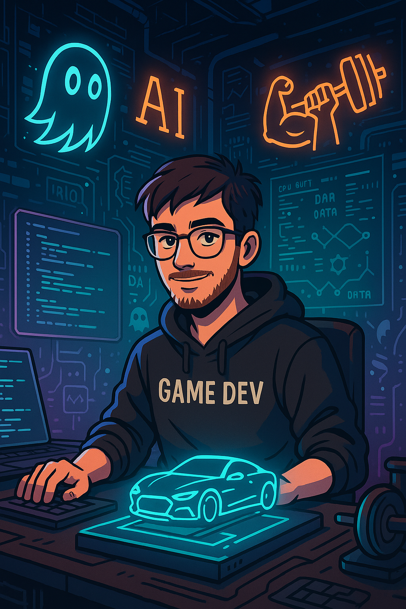

# 👋 Hi, I'm Cemalcan Bekmezci  
🎮 Game Developer | 🧠 AI Enthusiast | 🎓 Computer Programming Student

Welcome to my GitHub Profile!

- 👨‍💻 I’m developing games using **Unity** and **Unreal Engine**
- 🚀 Co-founder of Walty Games, with a published game on Steam: [Wild West Saloon Simulator](https://store.steampowered.com/app/3490230/Wild_West_Saloon_Simulator/)
- 🎯 Currently building a **3D FPS** project in Unity using the new Input System and custom character controller
- 🧪 My first Unity project was **[CikWik](https://github.com/Wq0L/Chikwik)**, where I learned state management, UI anchoring, and NPC behavior logic
- 💡 Passionate about learning by building

## 🛠️ Tools I Use

  
  
  
  
  
  

### 📫 Contact  
[LinkedIn →](https://www.linkedin.com/in/cemalcanbekmezci/) • [Email →](mailto:cemalcanbekmezci@gmail.com)

